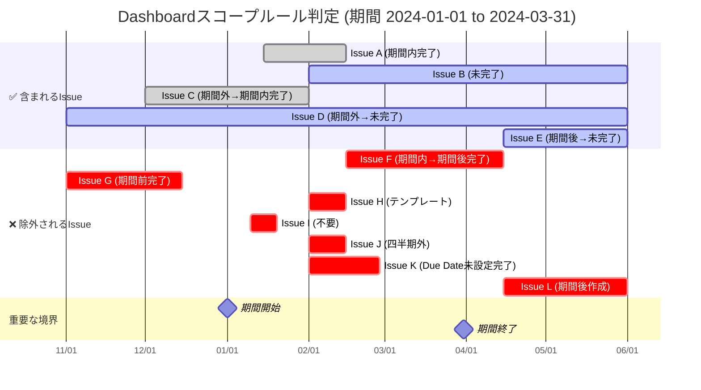
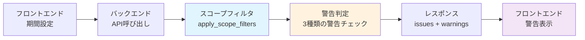

# GitLab Bud Chart

GitLab の issue を分析し、burn-up/burn-down チャート表示と product backlog 表示を行う Web アプリケーション。

## 動作イメージ

|  |  |
| ------------------------------- | -------------------------------- |

## 使い方

- 最新のビルド済みイメージを利用する場合

  ```bash
  # 前提: port 3000 が空いていること
  git clone https://github.com/suwa-sh/gitlab-bud-chart.git
  cd gitlab-bud-chart/docker

  cat << __EOF__ > .env
  SERVER_PORT=3000
  # gitlab接続の初期値
  #VITE_GITLAB_URL=
  #VITE_GITLAB_TOKEN=
  #VITE_GITLAB_PROJECT_ID=
  #VITE_HTTP_PROXY=
  #VITE_HTTPS_PROXY=
  #VITE_NO_PROXY=
  __EOF__

  docker compose pull
  docker compose up

  open http://localhost:3000
  ```

- ローカルビルドを使用したい場合

  ```bash
  # gitlab containerを利用する場合、事前に起動
  docker compose -f docker-compose.gitlab.yml up

  # gitlab containerのPAT(Personal Access Token)生成し、docker/.envに書き込み
  ../scripts/generate_gitlab_pat.sh
  # サンプルissue登録
  ../scripts/generate_gitlab_test_data.py

  # ローカルソースをビルドして実行
  docker compose -f docker-compose.local.yml build
  docker compose -f docker-compose.local.yml up
  ```

## 画面構成

### Dashboard

- **プロジェクト進捗の可視化**: Burn-up/Burn-down チャートによる進捗状況把握
- **チャート表示**: レスポンシブ対応、ウィンドウ幅 100%、Both/Burn Down/Burn Up の表示切り替え
- **統計情報**: 総ポイント、完了ポイント、完了率、残ポイント、残日数（営業日ベース）
- **期間設定**: 開始日・終了日による分析期間の指定
- **詳細フィルタ**: 12 種類のフィルタ（Service、Milestone、Epic、Title 検索、Point 範囲、Kanban Status、Assignee、作成日範囲、完了日範囲、State、Chart View）
- **Issues 一覧**: デフォルトでページング無効、ウィンドウ幅 100%、ソート可能
- **警告表示機能**: データ不整合の可能性があるIssueの警告表示（期間前完了・期間後完了・Due Date未設定の完了Issue）
- **URL 共有機能**: 現在のフィルタ・ソート条件を含む URL をワンクリックでコピー

### PBL Viewer

- **Product Backlog 管理**: 全 Issue 一覧表示（ウィンドウ幅 100%、レスポンシブ対応）
- **統計情報**: Issue 件数、総ポイント数、完了ポイント、完了率（Dashboard と統一フォーマット）
- **詳細フィルタ・検索**: 11 種類のフィルタ（期間フィルタは表示のみ、API 送信なし）
- **Issue 詳細表示**: ソート可能、全件表示対応
- **CSV エクスポート**: フィルタ適用済みデータのエクスポート
- **キャッシュ優先**: 初回ロード時はキャッシュデータを優先利用
- **デフォルトでページング無効**: 全件表示でデータ把握を重視
- **URL 共有機能**: 現在のフィルタ・ソート条件を含む URL をワンクリックでコピー

## 表示条件・フィルタリング

### 統一されたフィルタリングシステム

#### 統一フィルタルール

Dashboard と PBL Viewer で共通のフィルタリング機能を適用：

1. **除外ルール**: 以下の kanban_status を自動除外

   - `テンプレート` (GitLab ラベル: `#テンプレート`)
   - `ゴール/アナウンス` (GitLab ラベル: `#ゴール/アナウンス`)
   - `不要` (GitLab ラベル: `#不要`)

2. **日付補正**: `created_at > completed_at` の場合は `created_at = completed_at` に、`created_at < start_date` の場合は `created_at = start_date` に自動補正

3. **完了基準統一**: `completed_at` の存在により完了判定（従来の `state` ベースから変更）

#### URL 共有機能

両画面で以下のパラメータを URL クエリストリングとして保存・共有可能：

- **フィルタパラメータ**: service, milestone, assignee, kanban_status, state, is_epic, quarter
- **検索パラメータ**: search（タイトル検索）
- **ポイント範囲**: min_point, max_point
- **日付範囲**: created_after/before, completed_after/before
- **ソート設定**: sortKey, sortDirection
- **期間設定** (Dashboard のみ): period_start, period_end

**使用例**:

```
/pbl-viewer?service=API&milestone=2024Q1&sortKey=point&sortDirection=desc
/dashboard?period_start=2024-01-01&period_end=2024-03-31&state=closed&sortKey=created_at&sortDirection=asc
```

**共有方法**:

1. フィルタ・ソート条件を設定
2. 「🔗 URL を共有」ボタンをクリック
3. URL が自動的にクリップボードにコピーされる
4. 共有された URL を開くと、同じ条件で表示される

### Dashboard 表示条件

#### データ取得方法

- **API**: `/api/issues/` エンドポイントを使用
- **期間フィルタ**: `chart_start_date`, `chart_end_date` パラメータで期間指定
- **フィルタ順序**: 統一フィルタ適用 → スコープフィルタ適用
- **リアルタイム更新**: 設定変更時に常に API 再呼び出し

#### チャート生成条件

- **対象データ**: 統一フィルタ + スコープフィルタ適用済み Issue
- **営業日計算**: 日本の祝日を考慮した営業日ベースの理想線
- **統計表示**: 総ポイント、完了ポイント、完了率、残ポイント、残日数（営業日）

#### データフィルタリング・スコープルール

Dashboard と PBL Viewer で適用される統一されたフィルタリングシステム。4 段階の処理で Issue の表示対象を決定します。

##### 1. 四半期フィルタ

期間に対応する会計年度四半期のラベルを持つIssueのみを対象とします。

**四半期マッピング:**
- Q1: 4月-6月
- Q2: 7月-9月  
- Q3: 10月-12月
- Q4: 1月-3月

**例:**
- 期間: 2025-01-01～2025-07-31
- 対象四半期: @FY24Q4, @FY25Q1, @FY25Q2
- @FY25Q3ラベルのIssueは除外

##### 2. 統一フィルタルール

**除外対象 kanban_status:**

| kanban_status     | GitLab ラベル        | 除外理由                         | 例                       |
| ----------------- | -------------------- | -------------------------------- | ------------------------ |
| テンプレート      | `#テンプレート`      | Issue 作成用のテンプレート       | 「Issue 作成時の参考用」 |
| ゴール/アナウンス | `#ゴール/アナウンス` | 進捗管理対象外の告知事項         | 「プロジェクト目標設定」 |
| 不要              | `#不要`              | 削除予定・不要と判定された Issue | 「重複 Issue・誤作成」   |

##### 2. 日付補正ルール

**補正条件と方法:**

| 条件                        | 補正前                                                | 補正後                                                | 補正理由                                           |
| --------------------------- | ----------------------------------------------------- | ----------------------------------------------------- | -------------------------------------------------- |
| `created_at > completed_at` | created_at = 2024-02-20<br/>completed_at = 2024-02-15 | created_at = 2024-02-15<br/>completed_at = 2024-02-15 | データ整合性確保<br/>作成日 > 完了日は論理的に矛盾 |
| `created_at < start_date`   | created_at = 2023-12-15<br/>start_date = 2024-01-01   | created_at = 2024-01-01<br/>start_date = 2024-01-01   | 期間開始前のIssueを期間開始日に調整                |
| `created_at ≤ completed_at` | created_at = 2024-02-10<br/>completed_at = 2024-02-15 | **補正なし**                                          | 正常なデータ                                       |
| `completed_at = null`       | created_at = 2024-02-10<br/>completed_at = null       | **補正なし**                                          | 未完了 Issue（正常）                               |

##### 4. スコープ判定ルール

**除外ルール:**
1. `completed_at` が期間終了日より未来の Issue は除外
2. `completed_at` が期間開始日より過去の Issue は除外  
3. kanban_statusが「完了」「共有待ち」で `due_date` が未設定の Issue は除外
4. `created_at` が期間終了日より未来の Issue は除外

上記の除外ルールに該当しない Issue（未完了の Issue および期間内に完了した Issue）が表示対象となります。

##### 除外Issue警告表示

**警告システム概要**

バックエンドで警告判定を行い、データ不整合の可能性があるIssueを3種類に分類して警告表示します：

**警告タイプ:**

1. **期間前完了**: `completed_at` が期間開始日より前のIssue
   - 例: 期間 2024-01-01～2024-03-31、completed_at = 2023-12-15
   - 期間外で完了しているため、進捗チャートの精度に影響

2. **期間後完了**: `completed_at` が期間終了日より後のIssue  
   - 例: 期間 2024-01-01～2024-03-31、completed_at = 2024-04-15
   - 期間外で完了しているため、進捗チャートの精度に影響

3. **Due Date未設定**: kanban_statusが「完了」「共有待ち」だが `due_date` が未設定のIssue
   - completed_atが正しく計算されないため、スコープから除外される
   - 進捗管理の精度向上のためDue Date設定を推奨

4. **期間後作成**: `created_at` が期間終了日より後のIssue
   - 例: 期間 2024-01-01～2024-03-31、created_at = 2024-04-15
   - 期間外で作成されているため、スコープから除外される

**警告表示UI:**
- 各IssueへのGitLabリンクを提供
- 折りたたみ可能なUIで詳細確認
- Issue一覧とチャートの両方に適用
- 警告理由を明確に表示

##### スコープルール図解



**スコープ判定の具体例:**

**テスト期間: 2024-01-01 ～ 2024-03-31**

| Issue | 四半期    | 処理段階         | kanban_status | created_at | completed_at | due_date | state  | 最終判定 | 適用ルール                       |
| ----- | --------- | ---------------- | ------------- | ---------- | ------------ | -------- | ------ | -------- | -------------------------------- |
| A     | @FY23Q4   | スコープ通過     | #完了         | 2024-01-15 | 2024-02-15   | 2024-02-15 | closed | ✅ 含む  | 期間内完了                       |
| B     | @FY23Q4   | スコープ通過     | #作業中       | 2024-02-01 | -            | -        | opened | ✅ 含む  | 未完了                           |
| C     | @FY23Q4   | スコープ通過     | #完了         | 2023-12-01 | 2024-02-01   | 2024-02-01 | closed | ✅ 含む  | 期間内完了                       |
| D     | @FY23Q4   | スコープ通過     | #作業中       | 2023-11-01 | -            | -        | opened | ✅ 含む  | 未完了                           |
| E     | @FY23Q4   | スコープ通過     | #作業中       | 2024-04-15 | -            | -        | opened | ✅ 含む  | 未完了                           |
| F     | @FY23Q4   | スコープ除外     | #完了         | 2024-02-15 | 2024-04-15   | 2024-04-15 | closed | ❌ 除外  | 期間後完了（除外ルール1）→警告表示|
| G     | @FY23Q4   | スコープ除外     | #完了         | 2023-11-01 | 2023-12-15   | 2023-12-15 | closed | ❌ 除外  | 期間前完了（除外ルール2）→警告表示|
| H     | @FY23Q4   | 統一フィルタ除外 | #テンプレート | 2024-02-01 | -            | -        | opened | ❌ 除外  | 統一フィルタルール               |
| I     | @FY23Q4   | 統一フィルタ除外 | #不要         | 2024-01-10 | 2024-01-20   | 2024-01-20 | closed | ❌ 除外  | 統一フィルタルール               |
| J     | @FY24Q2   | 四半期フィルタ   | #作業中       | 2024-02-01 | -            | -        | opened | ❌ 除外  | 対象期間外の四半期               |
| K     | @FY23Q4   | スコープ除外     | #完了         | 2024-02-01 | -            | -        | opened | ❌ 除外  | Due Date未設定完了（除外ルール3）→警告表示|
| L     | @FY23Q4   | スコープ除外     | #作業中       | 2024-04-15 | -            | -        | opened | ❌ 除外  | 期間後作成（除外ルール4）→警告表示       |

**処理フロー概要:**

1. **四半期フィルタ**: 期間に対応する会計年度四半期のラベルを持つIssueのみを対象
2. **統一フィルタ**: テンプレート・ゴール/アナウンス・不要を自動除外
3. **日付補正**: `created_at > completed_at`の場合は`created_at = completed_at`に、`created_at < start_date`の場合は`created_at = start_date`に修正
4. **スコープ判定**: completed_atベースの除外ルール + Due Date未設定完了Issue除外で判定

#### フィルタ項目（12 種類）

1. **期間**: chart_start_date / chart_end_date
2. **Service**: サービス名での絞り込み
3. **Milestone**: マイルストーンでの絞り込み
4. **Epic**: Epic/通常 Issue での絞り込み
5. **Title**: タイトル部分一致検索
6. **Point**: 最小値・最大値での範囲指定
7. **Kanban Status**: かんばんステータスでの絞り込み
8. **Assignee**: アサイニーでの絞り込み
9. **Created At**: 作成日の期間指定
10. **Completed At**: 完了日の期間指定
11. **State**: opened/closed での状態絞り込み
12. **Chart View**: Both/Burn Down/Burn Up 表示切り替え

### PBL Viewer 表示条件

#### データ取得方法

- **API**: `/api/issues/` エンドポイントを使用
- **統一フィルタ**: Dashboard と同じ除外ルール・日付補正を適用
- **完了基準**: Dashboard と統一（`completed_at` ベース）
- **全量取得**: `per_page=10000` で大量データを一括取得
- **キャッシュ優先**: 初回ロード時はキャッシュデータを優先利用
- **期間フィルタ除外**: API 呼び出し時に期間関連フィルタを削除

#### 統計表示形式

Dashboard に合わせた統一フォーマット：

- **issue 件数**: 総 Issue 数
- **総ポイント数**: 全 Issue のポイント合計
- **完了ポイント**: 完了 Issue のポイント合計
- **完了率**: ポイントベースの完了率（完了ポイント/総ポイント数）

#### キャッシュ管理

- **初回ロード**: キャッシュデータがある場合は API 呼び出しをスキップ
- **設定変更時**: 常に API 再呼び出しでデータ更新
- **タイムスタンプ表示**: 最終更新時刻をヘッダーに表示

#### 期間フィルタの特別処理

```javascript
// PBL Viewer では以下のフィルタを API 呼び出し時に除外
delete filtersWithoutPeriod.created_after;
delete filtersWithoutPeriod.created_before;
delete filtersWithoutPeriod.completed_after;
delete filtersWithoutPeriod.quarter;
```

#### フィルタ項目（11 種類）

1. **Service**: サービス名での絞り込み
2. **Milestone**: マイルストーンでの絞り込み
3. **Epic**: Epic/通常 Issue での絞り込み
4. **Title**: タイトル部分一致検索
5. **Point**: 最小値・最大値での範囲指定
6. **Kanban Status**: かんばんステータスでの絞り込み
7. **Assignee**: アサイニーでの絞り込み
8. **Quarter**: 四半期での絞り込み（表示のみ、API には送信されない）
9. **Created At**: 作成日の期間指定（フロントエンド表示のみ）
10. **Completed At**: 完了日の期間指定（フロントエンド表示のみ）
11. **State**: opened/closed での状態絞り込み

#### 表示設定

- **ページング**: デフォルトで無効（Dashboard と統一）
- **全件表示**: `allowShowAll={true}` で有効
- **初期状態**: `initialShowAll={true}` で全件表示開始

### 共通仕様

#### 統一フィルタ機能

- **実装場所**: `/utils/issueFilters.ts` (フロントエンド)
- **除外対象**: `テンプレート`、`ゴール/アナウンス`、`不要` の kanban_status
- **日付補正**: created_at > completed_at の場合と created_at < start_date の場合の自動補正
- **適用範囲**: Dashboard チャート生成、Issues 一覧、PBL Viewer すべて

#### フィルタリセット

- **Dashboard**: 詳細フィルタエリアで個別リセット
- **PBL Viewer**: 全フィルタ一括リセット + API 再呼び出し

#### エラーハンドリング

- **セッション期限切れ**: 401/403 エラー時に GitLab 設定画面表示
- **接続エラー**: エラーメッセージ表示 + 再試行ボタン

## 警告システムの詳細説明

GitLab Bud Chart は、データ品質とプロジェクト管理の精度向上のため、問題となる可能性があるIssueを自動検出し警告表示する仕組みを提供しています。

### 警告判定のタイミング

警告判定は **バックエンドのスコープフィルタ処理時** に実行されます：

1. **Dashboard画面**: 期間設定（`chart_start_date`、`chart_end_date`）が指定された時
2. **API呼び出し**: `/api/issues/` エンドポイントで期間パラメータが渡された時
3. **リアルタイム更新**: フィルタ条件変更時に自動的に再判定

### 警告判定ロジック

#### 1. 期間前完了警告
```
判定条件: completed_at < chart_start_date
警告理由: 期間開始より前に完了しているため、進捗チャートに正確に反映されない
対処法: Due Dateまたは期間設定の見直し
```

#### 2. 期間後完了警告
```
判定条件: completed_at > chart_end_date  
警告理由: 期間終了より後に完了しているため、進捗チャートに正確に反映されない
対処法: Due Dateまたは期間設定の見直し
```

#### 3. Due Date未設定完了警告
```
判定条件: kanban_status IN ['完了', '共有待ち'] AND due_date IS NULL
警告理由: completed_atが計算できないため、スコープから除外される
対処法: 該当IssueにDue Dateを設定
```

### 警告データの流れ



### 警告表示の実装

#### バックエンド（Python）
- **場所**: `backend/app/utils/issue_filters.py:apply_scope_filters()`
- **戻り値**: `Tuple[List[IssueModel], List[Dict[str, Any]]]`
- **警告フォーマット**: `{'issue': IssueModel, 'reason': str}`

#### フロントエンド（React）
- **状態管理**: `AppContext.dashboardWarnings`
- **表示コンポーネント**: `ExcludedIssuesWarning.tsx`
- **更新タイミング**: API呼び出し時に `SET_DASHBOARD_WARNINGS` アクションで更新

### 運用での活用方法

1. **定期的な警告確認**: Dashboard表示時に警告件数をチェック
2. **データ品質向上**: 警告が出たIssueのDue Date設定を推進
3. **期間設定見直し**: 期間前/後完了が多い場合は期間設定を調整
4. **チーム教育**: 警告の意味と対処法をチームで共有

## Issue ラベル規則

GitLab Bud Chart は以下のラベル規則に基づいて Issue を自動分析します：

### ポイント設定

- `p:1.0`, `p:2.5`, `p:5.0` - ストーリーポイント
- 例: `p:3.0` = 3.0 ポイント

### Kanban ステータス

- `#作業中` - 進行中のタスク
- `#完了` - 完了したタスク
- `#レビュー中` - レビュー待ち
- `#テンプレート` - テンプレート（自動除外対象）
- `#ゴール/アナウンス` - ゴール/アナウンス（自動除外対象）
- `#不要` - 不要な Issue（自動除外対象）

### サービス分類

- `s:backend` - バックエンド関連
- `s:frontend` - フロントエンド関連
- `s:infrastructure` - インフラ関連

### 四半期分類

- `@FY25Q1` - 2025 年度第 1 四半期
- `@FY25Q2` - 2025 年度第 2 四半期

### エピック

- `epic`

### 完了日時（completed_at）決定ルール

GitLab Bud Chart では、Issueの完了日時（`completed_at`）を以下のルールで自動決定します：

#### 完了日時設定条件

| 条件 | kanban_status | due_date | state | 結果 | 備考 |
|------|---------------|----------|-------|------|------|
| 1 | `完了` | 設定あり | 任意 | `completed_at = due_date` | 推奨パターン |
| 2 | `共有待ち` | 設定あり | 任意 | `completed_at = due_date` | 推奨パターン |
| 3 | `完了` | 未設定 | 任意 | `completed_at = null` | ⚠️ 警告対象・スコープ除外 |
| 4 | `共有待ち` | 未設定 | 任意 | `completed_at = null` | ⚠️ 警告対象・スコープ除外 |
| 5 | その他 | 任意 | `closed` | `completed_at = null` | stateのみでは完了扱いしない |
| 6 | その他 | 任意 | `opened` | `completed_at = null` | 未完了 |

#### 重要なポイント

1. **GitLabの`closed_at`は使用しない**: kanban_statusとdue_dateベースで判定
2. **Due Date必須**: 完了扱いするには`due_date`の設定が必要
3. **警告システム連携**: Due Date未設定の完了Issueは自動で警告表示
4. **スコープ除外**: 条件3,4のIssueはDashboardのスコープから除外される

#### 実装場所

- **バックエンド**: `backend/app/services/issue_analyzer.py:_determine_completed_at()`
- **ロジック**: kanban_statusが「完了」「共有待ち」の場合のみdue_dateをcompleted_atに設定

```python
def _determine_completed_at(self, issue: IssueModel) -> Optional[datetime]:
    if issue.due_date and issue.kanban_status:
        if issue.kanban_status in ['完了', '共有待ち']:
            return issue.due_date
    return None
```

## 設計

- [プロンプト](/docs/develop/prompt.md)


# 以下、claude がつくったもの

## 機能

- **GitLab 連携**: Self-hosted GitLab からの issue 取得
- **Issue 分析**: ラベルベースの自動分析（point, kanban_status, service, quarter）
- **Burn-up/Burn-down チャート**: プロジェクト進捗可視化
- **Product Backlog 管理**: Issue 一覧表示・フィルタ・検索
- **統計分析**: 完了率、ベロシティ等の統計情報

## 技術スタック

- **Frontend**: React + TypeScript + Vite
- **Backend**: Python + FastAPI
- **Testing**: Playwright (E2E) + pytest (Backend) + Vitest (Frontend)
- **Charts**: Recharts
- **Styling**: CSS3 + Responsive Design

## セットアップ

### 前提条件

- Node.js 18+
- Python 3.8+
- GitLab Personal Access Token

### インストール

```bash
# リポジトリクローン
git clone <repository-url>
cd gitlab-bud-chart

# Backend セットアップ
cd backend
python -m venv venv
source venv/bin/activate  # Windows: venv\Scripts\activate
pip install -r requirements.txt

# Frontend セットアップ
cd ../frontend
npm install
```

### 起動

```bash
# Backend起動
cd backend
source venv/bin/activate
uvicorn app.main:app --reload

# Frontend起動（別ターミナル）
cd frontend
npm run dev
```

アプリケーションは http://localhost:3000 でアクセス可能です。

### GitLab 設定

1. GitLab Personal Access Token を作成

   - GitLab > Settings > Access Tokens
   - 権限: `api`, `read_repository`, `read_user`

2. アプリケーションで GitLab 設定

   - GitLab URL: `http://your-gitlab-url`
   - Access Token: 作成したトークン
   - Project ID: 対象プロジェクトの ID

3. Issue 分析用ラベル設定（詳細は `docs/develop/specs/issue_rules.md` 参照）

## 開発

### ディレクトリ構造

```
├── backend/          # Python FastAPI
│   ├── app/
│   │   ├── api/      # API エンドポイント
│   │   ├── models/   # データモデル
│   │   ├── services/ # ビジネスロジック
│   │   └── tests/    # テスト
│   └── requirements.txt
├── frontend/         # React TypeScript
│   ├── src/
│   │   ├── components/ # UIコンポーネント
│   │   ├── hooks/      # カスタムフック
│   │   ├── services/   # API呼び出し
│   │   └── types/      # 型定義
│   └── tests/        # E2Eテスト
├── docs/             # ドキュメント
└── scripts/          # スクリプト
```

### テスト実行

```bash
# 全テスト実行
./scripts/final-verification.sh

# Backend テスト
cd backend
source venv/bin/activate
pytest tests/ -v --cov=app

# Frontend E2E テスト
cd frontend
npx playwright test
```

### API エンドポイント

#### GitLab Connection

- `POST /api/gitlab/connect` - GitLab 接続設定
- `GET /api/gitlab/status` - 接続状態確認

#### Issues

- `GET /api/issues` - Issue 一覧取得
- `GET /api/issues/{id}` - Issue 詳細取得
- `GET /api/issues/analyzed` - 分析済み Issue 取得
- `GET /api/issues/statistics` - Issue 統計情報

#### Charts

- `GET /api/charts/burn-down` - Burn-down チャートデータ
- `GET /api/charts/burn-up` - Burn-up チャートデータ
- `GET /api/charts/velocity` - ベロシティデータ

詳細な API ドキュメントは http://localhost:8000/docs で確認できます。

## パフォーマンス

### 最適化機能

- **Backend**: キャッシュ機能、並列処理、メモリ最適化
- **Frontend**: 仮想化、メモ化、遅延読み込み
- **Charts**: データ点数制限、効率的な描画

### 性能要件

- 1000 件 Issue 処理: < 10 秒
- チャート描画: < 3 秒
- UI 応答性: < 1 秒

## デプロイ

### Docker（推奨）

```bash
# Backend
cd backend
docker build -t gitlab-bud-chart-backend .
docker run -p 8000:8000 gitlab-bud-chart-backend

# Frontend
cd frontend
docker build -t gitlab-bud-chart-frontend .
docker run -p 3000:3000 gitlab-bud-chart-frontend
```

### 手動デプロイ

```bash
# Backend
cd backend
source venv/bin/activate
pip install -r requirements.txt
uvicorn app.main:app --host 0.0.0.0 --port 8000

# Frontend
cd frontend
npm install
npm run build
npm run preview
```

## トラブルシューティング

### よくある問題

**GitLab 接続エラー**

- Access Token の権限確認
- GitLab URL の正確性確認
- ネットワーク接続確認

**チャート表示されない**

- Issue にポイントラベルが設定されているか確認
- 期間選択が適切か確認
- ブラウザのコンソールエラー確認

**パフォーマンス問題**

- 大量データの場合は期間を絞る
- ブラウザのキャッシュクリア
- メモリ使用量確認

### ログ確認

```bash
# Backend ログ
tail -f backend/logs/app.log

# Frontend ログ
ブラウザの開発者ツール > Console
```

## 貢献

1. Issue で課題・機能要望を作成
2. フィーチャーブランチで開発
3. テスト実行・確認
4. Pull Request 作成
5. レビュー後マージ

### 開発ガイドライン

- TypeScript 型安全性の維持
- テストカバレッジ 80%以上
- ESLint/Prettier 設定に従う
- セキュリティ要件の遵守

## ライセンス

MIT License

## サポート

- Issue 報告: GitHub Issues
- ドキュメント: `docs/` ディレクトリ
- 開発者向け: `docs/develop/` ディレクトリ

---

**🎉 GitLab Bud Chart で効率的なプロジェクト管理を！**
