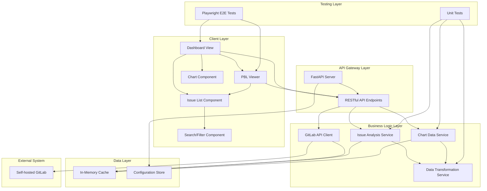

# ADR-001: アーキテクチャ設計

## 決定事項

gitlab-bud-chartプロジェクトのシステムアーキテクチャとして、**フロントエンド・バックエンド分離型SPA構成**を採用し、RESTful APIによる通信方式を選定する。

## 根拠

### 1. 要件適合性
- **ログイン不要仕様**: 認証レイヤーを排除し、設定ベースの接続に集中
- **Self-hosted GitLab対応**: 独立したBackendがGitLab接続設定を管理
- **チャート表示・Issue分析**: Frontend/Backend責務分離により効率的な開発が可能

### 2. 技術的優位性
- **スケーラビリティ**: Frontend/Backend独立デプロイによる運用柔軟性
- **保守性**: 明確な責務分離による可読性・テスト性向上
- **拡張性**: APIファーストアプローチによる将来的機能追加対応

### 3. 開発効率性
- **並行開発**: Frontend/Backend同時進行可能
- **テスト性**: 各層独立テスト実施可能
- **デバッグ性**: 責務分離による問題箇所特定の容易さ

## 詳細な設計内容

### アーキテクチャ概要図



### レイヤー別責務定義

#### Client Layer (Frontend)
- **責務**: ユーザーインターフェース提供、ユーザー操作処理
- **技術**: React + TypeScript, Vite
- **主要機能**:
  - Dashboard表示（Burn-up/Burn-downチャート）
  - Product Backlog表示（Issue一覧）
  - 検索・フィルタリング機能
  - GitLab接続設定UI

#### API Gateway Layer (Backend Entry Point)
- **責務**: APIエンドポイント提供、リクエスト/レスポンス管理
- **技術**: FastAPI + Uvicorn
- **主要機能**:
  - RESTful API提供
  - リクエストバリデーション
  - エラーハンドリング
  - API文書自動生成

#### Business Logic Layer (Backend Core)
- **責務**: ビジネスロジック実装、データ処理
- **技術**: Python + Pydantic
- **主要機能**:
  - GitLab API統合
  - Issue分析処理
  - チャートデータ生成
  - データ変換処理

#### Data Layer (Data Management)
- **責務**: データ保存・取得、キャッシュ管理
- **技術**: In-Memory Cache, File-based Config
- **主要機能**:
  - Issueデータキャッシュ
  - 設定情報管理
  - データ永続化（設定のみ）

### API設計原則

#### RESTful API設計
```
GET    /api/issues              # Issue一覧取得
GET    /api/issues/{id}         # 特定Issue取得
GET    /api/charts/burn-up      # Burn-upチャートデータ
GET    /api/charts/burn-down    # Burn-downチャートデータ
GET    /api/config              # GitLab接続設定取得
POST   /api/config              # GitLab接続設定更新
GET    /api/health              # ヘルスチェック
```

#### データフロー設計
1. **Frontend Request** → API Gateway Layer
2. **API Validation** → Business Logic Layer
3. **Business Processing** → Data Layer / External System
4. **Data Response** → API Gateway Layer → Frontend

### 非機能要件への対応

#### パフォーマンス
- **キャッシュ戦略**: Issue データのメモリキャッシュ
- **データ圧縮**: API レスポンス gzip 圧縮
- **非同期処理**: FastAPI の async/await 活用

#### 可用性
- **エラーハンドリング**: 各層での適切な例外処理
- **フォールバック**: GitLab 接続エラー時の代替処理
- **ヘルスチェック**: システム状態監視 API

#### セキュリティ
- **入力検証**: Pydantic による厳密なバリデーション
- **CORS 設定**: Frontend オリジン制限
- **設定保護**: GitLab トークンの安全な管理

### 制約事項と前提条件

#### 制約事項
- 認証機能は実装しない（要件による）
- データベースは使用しない（軽量化要件）
- CI/CD パイプラインは対象外

#### 前提条件
- Self-hosted GitLab へのネットワークアクセス可能
- GitLab API トークンの事前準備
- Node.js 18+ および Python 3.11+ 実行環境

### 将来拡張への考慮

#### 拡張可能性
- **認証機能追加**: 現アーキテクチャへの OAuth2 統合可能
- **データベース導入**: Data Layer での永続化戦略変更可能
- **マルチ GitLab 対応**: Configuration Store 拡張で対応

#### 技術負債回避
- **依存関係管理**: 各層の疎結合設計
- **テスト戦略**: 層別テスト実装による品質担保
- **文書化**: ADR による意思決定記録の維持

## 承認

- **決定日**: 2025-06-28
- **承認者**: Development Team
- **レビュー予定**: Task 12 完了時点