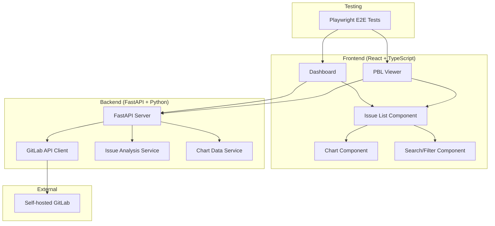

# Task 01: プロジェクト基盤構築・ADR作成

## 概要
プロジェクト構造設計、技術選定、ADR作成を行い、gitlab-bud-chartプロジェクトの基盤を構築する。

## 目的
- プロジェクト全体構造の設計・定義
- 技術スタック選定・根拠記録
- ADR（Architecture Decision Record）作成
- 開発ディレクトリ構造作成

## 前提条件
- `docs/develop/plan.md` 作成済み
- 要件仕様書確認済み（`docs/develop/specs/`）

## 作業手順

### 1. プロジェクト構造設計

#### 1.1 全体アーキテクチャ図作成


#### 1.2 ディレクトリ構造設計
```
gitlab-bud-chart/
├── backend/
│   ├── app/
│   │   ├── __init__.py
│   │   ├── main.py
│   │   ├── api/
│   │   │   ├── __init__.py
│   │   │   ├── issues.py
│   │   │   └── charts.py
│   │   ├── services/
│   │   │   ├── __init__.py
│   │   │   ├── gitlab_client.py
│   │   │   ├── issue_analyzer.py
│   │   │   └── chart_generator.py
│   │   ├── models/
│   │   │   ├── __init__.py
│   │   │   ├── issue.py
│   │   │   └── chart.py
│   │   └── config.py
│   ├── tests/
│   │   ├── __init__.py
│   │   ├── test_api/
│   │   ├── test_services/
│   │   └── test_models/
│   ├── requirements.txt
│   └── pyproject.toml
├── frontend/
│   ├── src/
│   │   ├── components/
│   │   │   ├── Dashboard/
│   │   │   ├── PBLViewer/
│   │   │   ├── IssueList/
│   │   │   ├── Chart/
│   │   │   └── Common/
│   │   ├── hooks/
│   │   ├── services/
│   │   ├── types/
│   │   ├── utils/
│   │   ├── App.tsx
│   │   └── main.tsx
│   ├── tests/
│   │   ├── unit/
│   │   └── e2e/
│   ├── package.json
│   ├── tsconfig.json
│   └── vite.config.ts
├── docs/
│   ├── develop/ (既存)
│   └── api/
└── scripts/
    ├── setup.sh
    └── run-e2e.sh
```

### 2. ADR作成

#### 2.1 ADR-001: アーキテクチャ設計
**作成ファイル**: `docs/develop/adr/001-architecture.md`

**決定事項**:
- フロントエンド・バックエンド分離型SPA構成
- RESTful API通信
- 認証不要・設定ベース接続

**根拠**:
- 要件: ログイン不要、self-hosted GitLab対応
- スケーラビリティ: Frontend/Backend独立開発・デプロイ可能
- 保守性: 責務分離による可読性・テスト性向上

#### 2.2 ADR-002: 技術スタック選定
**作成ファイル**: `docs/develop/adr/002-tech-stack.md`

**Frontend選定**:
- **React + TypeScript**: 型安全性、豊富なエコシステム
- **Vite**: 高速な開発サーバー、モダンなビルドツール
- **React Router**: SPA標準ルーティング
- **Recharts**: React向けチャートライブラリ
- **Axios**: HTTP通信ライブラリ

**Backend選定**:
- **FastAPI**: 高性能、自動APIドキュメント生成、型ヒント対応
- **Python-GitLab**: GitLab API公式ライブラリ
- **Uvicorn**: ASGI高性能サーバー
- **Pydantic**: データバリデーション・シリアライゼーション

**Testing選定**:
- **Playwright**: クロスブラウザE2Eテスト、スクリーンショット対応
- **pytest**: Python標準テストフレームワーク
- **Vitest**: Viteベースの高速テストランナー

#### 2.3 ADR-003: データモデル設計
**作成ファイル**: `docs/develop/adr/003-data-model.md`

**Issue Data Model**:
```python
class IssueModel:
    id: int
    title: str
    description: str
    state: str  # opened, closed
    created_at: datetime
    updated_at: datetime
    due_date: Optional[datetime]
    assignee: Optional[str]
    milestone: Optional[str]
    labels: List[str]
    
    # Analyzed fields (from labels)
    point: Optional[float]  # p:1.0, p:2.0
    kanban_status: Optional[str]  # #作業中, #完了
    service: Optional[str]  # s:service-name
    quarter: Optional[str]  # @FY2501
    completed_at: Optional[datetime]  # due_date
```

**Chart Data Model**:
```python
class ChartDataModel:
    date: date
    planned_points: float
    actual_points: float
    remaining_points: float
    completed_issues: int
    total_issues: int
```

### 3. 開発環境設定準備

#### 3.1 基本ディレクトリ作成
```bash
mkdir -p backend/app/{api,services,models,tests}
mkdir -p frontend/src/{components,hooks,services,types,utils}
mkdir -p docs/{develop/adr,api}
mkdir -p scripts
```

#### 3.2 設定ファイルテンプレート準備
- `backend/pyproject.toml`
- `frontend/package.json`
- `frontend/tsconfig.json`
- `frontend/vite.config.ts`

## 成果物

### 必須成果物
1. **ADR文書**:
   - `docs/develop/adr/001-architecture.md`
   - `docs/develop/adr/002-tech-stack.md`
   - `docs/develop/adr/003-data-model.md`

2. **プロジェクト構造**:
   - ディレクトリ構造作成
   - 基本設定ファイル配置

3. **設計文書**:
   - アーキテクチャ図（Mermaid）
   - データモデル定義
   - API設計概要

### 参考成果物
- 技術選定比較表
- 開発環境構築手順書

## 検証項目

### 実施前確認
- [ ] 要件仕様書の理解完了
- [ ] 既存サンプルコードの調査完了
- [ ] 技術選定の調査完了

### 実施後確認
- [ ] ADRが要件に準拠している
- [ ] プロジェクト構造が明確に定義されている
- [ ] 技術選定の根拠が明確
- [ ] データモデルが要件を満たしている
- [ ] ディレクトリ構造が作成されている

### 品質確認
- [ ] ADR文書が第三者に理解可能
- [ ] アーキテクチャ図が実装に適用可能
- [ ] データモデルが拡張性を考慮している

## 次のタスクへの引き継ぎ

### Task 02への引き継ぎ事項
- ADR準拠の技術スタック
- プロジェクト構造に基づいた環境構築
- データモデルに基づいたAPI設計

### 注意事項
- ADR決定事項は以降のタスクで遵守すること
- 技術選定変更時は必ずADR更新すること
- データモデル変更は影響範囲を慎重に検討すること

## 作業時間見積もり
- **設計作業**: 2-3時間
- **ADR作成**: 2-3時間
- **ディレクトリ構築**: 1時間
- **検証・文書化**: 1時間
- **合計**: 6-8時間