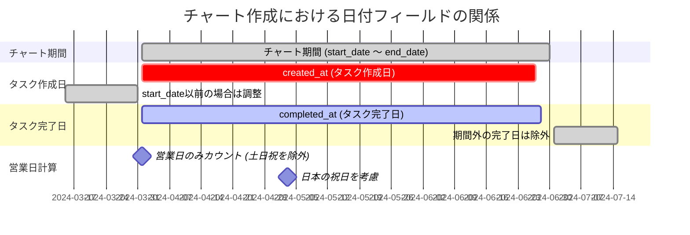

# bud-chart-python チャート作成時の日付処理

## 概要

bud-chart-pythonでは、バーンアップ・バーンダウンチャートを作成する際に、複数の日付フィールドを使用してスケジュールと進捗を管理します。本ドキュメントでは、各日付の役割と処理方法について説明します。

## 日付フィールドのタイムライン

## 日付フィールドの詳細説明

| フィールド名 | データソース | 目的 | 処理ロジック | 備考 |
|------------|------------|------|------------|------|
| **start_date** | ユーザー指定 | チャート開始日 | - チャート全体の開始日を定義 - 文字列形式: "YYYY-MM-DD" | チャートの範囲を決定する基準日 |
| **end_date** | ユーザー指定 | チャート終了日 | - チャート全体の終了日を定義 - 文字列形式: "YYYY-MM-DD" | チャートの範囲を決定する基準日 |
| **created_at** | GitLabイシュー | タスク作成日 | - start_dateより前の場合、start_dateに調整 - 予定ポイントの計算に使用 | `glissue_csv.py:134-136`で調整処理 |
| **completed_at** | GitLabイシュー (due_dateをリネーム) | タスク完了日 | - start_date以前の場合は除外 - end_date以降の場合は除外 - 実績ポイントの計算に使用 | `glissue_csv.py:28`でリネーム `glissue_csv.py:159-166`で検証 |
| **営業日** | 日本のカレンダー | ポイント消化計算 | - 土日を除外 - 日本の祝日を除外（jpholidayライブラリ使用） - 平均消化ポイントの計算に使用 | `chart_csv.py:204-209`で判定処理 |

## 日付処理の主要な特徴

### 1. 作成日の調整
- タスクの作成日がチャート開始日より前の場合、自動的にstart_dateに調整されます
- これにより、チャート期間外で作成されたタスクも含めることができます

### 2. 完了日による除外
- 完了日がチャート期間外（start_date以前またはend_date以降）の場合、そのタスクはチャートから除外されます
- これにより、チャート期間内の実績のみを正確に表示できます

### 3. 営業日計算
- 予定消化ポイントの計算では、営業日のみをカウントします
- 土日および日本の祝日は除外されます
- 平均消化ポイント = 総ポイント ÷ 期間内営業日数（0.1ポイント単位で切り上げ）

### 4. 累積値の計算
- **予定累積**: created_atベースで日々のポイントを累積
- **実績累積**: completed_atベースで日々のポイントを累積
- **予定残**: 総ポイントから営業日ごとに平均消化ポイントを減算
- **実績残**: 総ポイントから実績累積を減算

## 処理フローの例

1. **CSV読み込み** (`glissue_csv.py`)
   - GitLabのdue_dateをcompleted_atにリネーム
   - ラベルからポイント、ステータス等を抽出

2. **データクレンジング** (`glissue_csv.py:cleansing`)
   - created_atがstart_date以前の場合は調整
   - completed_atが期間外の場合は除外
   - ポイントが0以下の場合は除外

3. **チャート生成** (`chart_csv.py:create`)
   - 期間内の全日付でレイアウト作成
   - 営業日ベースで予定消化を計算
   - 日付ごとに累積・残数を計算

4. **出力** 
   - バーンアップチャート: 累積値の推移
   - バーンダウンチャート: 残数の推移